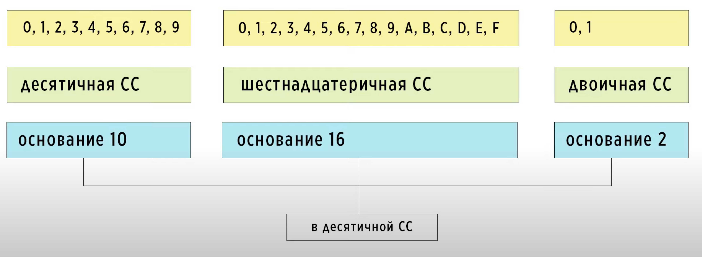
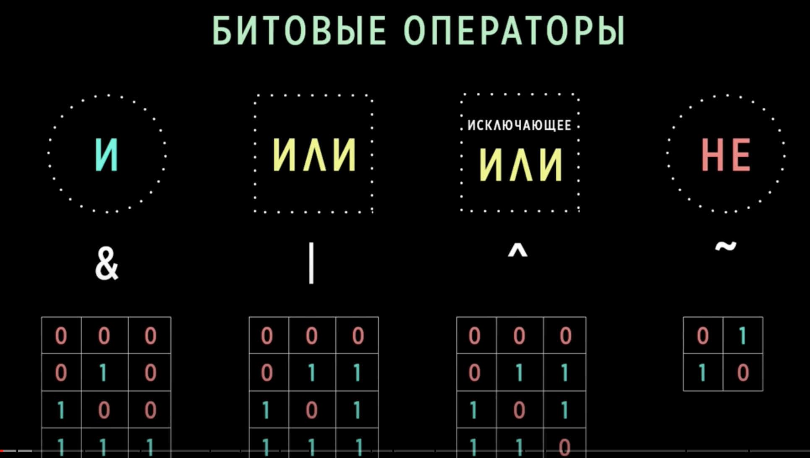
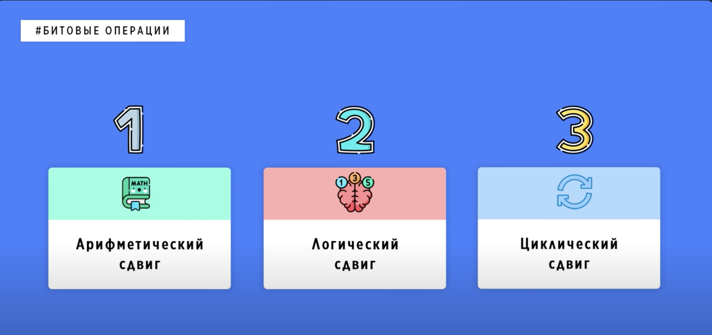

# About Decimal by Hatchesn

## Project structure

Decimal - число с плавающей точкой, которое может давать абсолютную точность

Минус Decimal - только програмная реализвация, и соотвтественно медленная работа

## Основные проблемы в проекте

Проект обьемный, и многие не понимают с чего начать.

### Что нужно знать и понимать перед тем как кодить:

- 1. Системы счисления.

10 в разных системах счисления

Формула перевода 

- 2. Как работают отрицательыне числа: прямой, обратный и дополнительный коды

Отрицательное  число в прямом коде

Отрицательное число в обратном коде

Отрицательное  число в дополнительном коде

Пример вычитания сложением отрицательного числа

- 3. Стандарт IEEE - 754. Как работают числа с плавающей точкой.

Формула вычисления

Как отображаются бесконечности и неопределенности

Диапазон экспоненты

Калькулятор перевода

Проблемы конвертации и вычислений

Проблемы с периодом

- 4. Побитовые операции.

Арифметичексие побитовые операции.

Операция "И"

Операция "ИЛИ"

Операция "Исключающее ИЛИ"

- 5. Битовые сдвиги.

Виды Битовых сдвигов

Арифметический битовый сдвиг

Пример реализации в коде на одном из языков програмирования

#### Полезные ссылки 

- https://calcus.ru/perevod-sistem-schisleniya/iz-dvoichnoy-v-desyatichnuyu 

- https://www.h-schmidt.net/FloatConverter/IEEE754.html

- https://learnc.info/c/bitwise_operators.html

- https://www.youtube.com/@AlekOS

У @AlekOS есть много видео по теме, которые могут помочь в понимании и написании кода. В частности видео по темам "Битовые операции" и "Битовые сдвиги" могут быть полезны. 
Многие скриншоты - с его видео.

### Состав команды.

Оптимально 2 - 3 человека.
Распределение задач на команду из 3х человек:

1ый пишет: основная часть вспомогательных функций, операции сравнения, потом арифметические операции.

2ой пишет: вспомогательные функции, операции конвертации и часть других функций.

3ий пишет: тесты и часть других функций.

### Последовательность написания вспомогательных функций:

- Проверка бита.

- Установка бита и установка нуля.

- Получение знака.

- Установка знака.

- Получение шкалы.

- Установка шкалы.

- Проверка на ноль.

- Взятие Decimal по модулю.

- Очистка Decimal.

- Копирование Decimal.

- Сложение Decimal без шкалы с проверкой и возвратом переполнения, если оно есть.

- Умножение на 10 Decimal без шкалы. (Реализуется либо сложением 10 раз либо сдвигом на 3 бита и сложением 2 раза)

- Увеличение шкалы.

- Сдвиг влево.

- Сдвиг вправо.

- Перевод Decimal  в доп код.

- Нахождение первого бита.

- Деление на 10 без шкалы.

- Деление без шкалы.

- Понижение шкалы.

- Приведение шкалы двух децималов к одному числу (минимальному, что бы не потерять точность)

## Арифметические операции

К написанию арифметических операций нужно приступать после того, как готовы вспомогательные функции и функции сравнения.

### Addition

Сложение в двоичном виде 

- Возможная проблемма - это переполнение при сложении двух больших Decimal.

- Для того, чтобы написать функцию сложения нужно:

- 1. Привести оба числа к одной шкале. При этом для соблюдения необходимой точности мы приводим чилсо с меньшей шкалой к большей. Но делаем это так,чтобы не было переполнения.

- 2. Выяснить знаки чисел.

- 3. Если знаки чисел разные:

- 3.1. Отрицательное число взять его модуль и сравнить с положительным. Для того, чтобы поставить флаг в случае,если отрицательное число будет больше, чтобы потом поставить знак результата как указывает флаг. (знак большего числа)

- 3.1. Перевести отрицательное число в дополнительный код и сложить два числа.

- 3.2. Поставить знак.

- 4. Если знаки чисел равны:

- 4.1. Если оба числа положительные, cложить два числа и если результат больше максимального числа, то поставить флаг и вернуть переполнение как S21_INF_A.

- 4.2. Если оба числа отрицательные, cложить два числа и если результат меньше минимального числа, то поставить флаг и вернуть переполнение как S21_NEG_INF_A.

### Subtraction

- Возможная проблема - это переполнение при вычитании двух больших Decimal.

- Для того, чтобы написать функцию вычитания нужно:

- 1. Привести оба числа к одной шкале. При этом для соблюдения необходимой точности мы приводим чилсо с меньшей шкалой к большей. Но делаем это так, чтобы не было переполнения.

- 2. Выяснить знаки чисел.

- 3. Если знаки чисел разные: 

- 3.1. Просто складываем два числа. Следим за знаком при этом и переполнением по аналогии со сложением.

- 4. Если знаки чисел равны:

- 4.1. Если оба числа положительные, использовать сложение с доп кодом второго числа. При этом если вычитатель больше вычитаемого, не забыть про еше раз перевод в доп код результата и установку знака.

- 4.2. Если оба числа отрицательные, использовать сложение с доп кодом первого числа. При этом если вычитатель по модудю меньше вычитаемого по модудю, не забыть про еше раз перевод в доп код результата и установку знака.

### Multiplication and Division

- Основная проблемма с арифметическими операциями - это умножение и деление. Для них нужно избежать переполнения. 

Есть несколько вариантов решения этой задачи:

 - Использование Big Decimal.

 - Использование BCD.

- Использование специальных алгоритмов для работы с первым интом Decimal.

Я в своем пректе использовал Big Decimal по аналогии с С#

typedef struct {

  unsigned int bits[6];

} s21_big_decimal;

Для того, чтобы использовать Big Decimal нужно написать для него вспомогательные функции с учетом того, что у него есть 6 байт, функции конвертации.

### Multiplication

Умножение в двоичном виде 

- Для того чтобы написать функцию умножения нужно:

- Проверить числа на ноль.

- Конвертировать Decimal в Big Decimal.

- При умножении шкалы - складываются, делаем результирующую шкалу и знак.

- Делаем цикл, который будет сдигать множимое на количетво битов в единице множителя и складывать результаты.

- Делаем обратную ковертацию в Decimal.

### Division

Деление в двоичном виде

- Для того чтобы написать функцию деления нужно:

- Проверить числа на ноль.

- Проверить числа на равенство.

- Конвертировать Decimal в Big Decimal.

- При деление шкалы вычитаются делаем резултирующую шкалу и знак.

- Делаем цикл, который будет сдигать делимое на количетво битов в удинице делителя, используя маску для записи результатов и складывать результаты.

- Делаем обратную ковертацию в Decimal.
